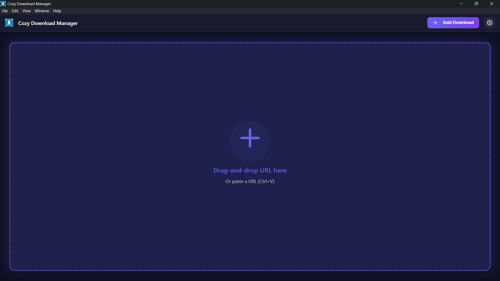
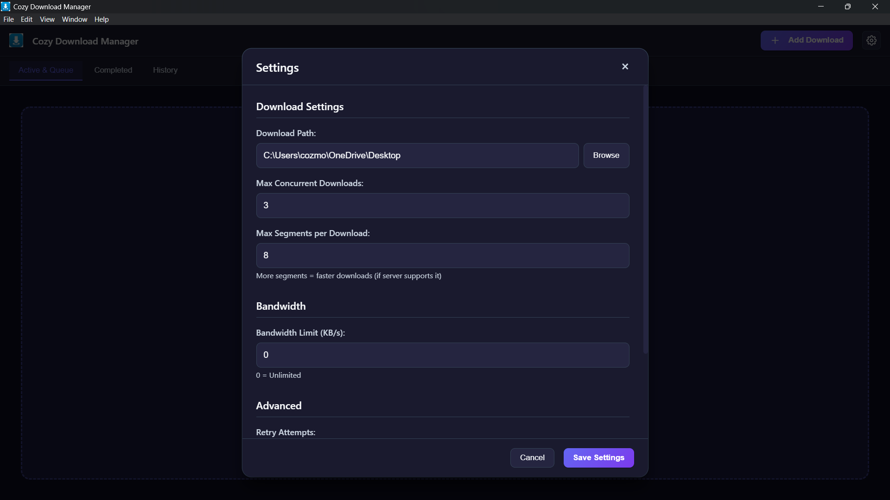

# Cozy Download Manager (CDM)


A professional-grade, sophisticated download manager built with Electron - comparable to Free Download Manager (FDM) and Internet Download Manager (IDM).

## 📸 Screenshots

### Main Interface

*Clean and minimal interface with drag-and-drop support*

### Download Progress

*Real-time progress tracking with speed and ETA*

### Settings Panel

*Comprehensive settings for download management*

> **Note**: Screenshots should be placed in a `screenshots/` directory. Add your actual screenshots there and they will be displayed above.

## ✨ Features

### 🚀 Advanced Download Engine
- **Multi-Segment Downloads**: Automatically splits large files into multiple segments (up to 16) for maximum speed
- **High-Performance Engine**: Optimized JavaScript with Node.js native HTTP/HTTPS modules
- **Intelligent Chunking**: Optimizes segment size based on file size and server capabilities
- **Range Request Support**: Automatically detects and uses HTTP Range requests for resumable downloads
- **Smart Retry Logic**: Automatic retry with exponential backoff on failures
- **Bandwidth Management**: Configurable bandwidth limiting to control network usage

### 📊 Queue Management
- **Priority System**: High, Normal, and Low priority levels
- **Concurrent Downloads**: Configurable maximum concurrent downloads (1-10)
- **Queue Control**: Move downloads up/down in queue, change priorities on the fly
- **Auto-Queue**: Automatically starts next download when one completes

### 💾 Persistence & Recovery
- **State Persistence**: Automatically saves download state to disk
- **Resume Capability**: Resume interrupted downloads after app restart
- **Download History**: Tracks completed downloads with metadata
- **Auto-Recovery**: Restores incomplete downloads on startup

### 🎯 Advanced Features
- **Real-time Progress**: Live progress bars with speed and ETA
- **Download Statistics**: Track active, queued, and completed downloads
- **File Management**: Open files or show in folder directly from the app
- **Settings Panel**: Comprehensive settings for all download parameters
- **Tabbed Interface**: Separate views for Active/Queue, Completed, and History

### 🔧 Technical Excellence
- **High-Performance Networking**: Uses Node.js native HTTP/HTTPS modules
- **Multi-threaded Downloads**: Parallel segment downloads using async operations
- **Efficient Memory Management**: Streaming file writes for large downloads
- **Event-Driven Architecture**: Optimized for performance and responsiveness
- **Event-Driven Architecture**: Efficient event-based communication
- **Memory Efficient**: Smart memory management for large file downloads
- **Error Handling**: Robust error handling with detailed error messages

## 📦 Installation

1. Clone or download this repository
2. Install dependencies:
```bash
npm install
```

3. Run the application:
```bash
npm start
```


## 🛠️ Development

To run in development mode with DevTools:
```bash
npm run dev
```

## 🏗️ Building

To build the application for distribution:
```bash
npm run build
```

## 📖 Usage

### Adding Downloads

1. Click "Add Download" button
2. Enter the download URL
3. Optionally specify a custom filename
4. Select priority (High, Normal, or Low)
5. Click "Start Download"

### Managing Downloads

- **Pause/Resume**: Click pause/resume buttons on active downloads
- **Change Priority**: Click "Priority" button to cycle through priority levels
- **Queue Control**: Use "Up" and "Down" buttons to reorder queued downloads
- **Cancel**: Cancel any non-completed download
- **Open Files**: Click "Open" to open completed files, or "Show in Folder" to reveal in file explorer

### Settings

Access settings via the ⚙️ button in the header:

- **Download Path**: Set custom download location
- **Max Concurrent Downloads**: Control how many downloads run simultaneously (1-10)
- **Max Segments**: Number of parallel segments per download (1-16)
- **Bandwidth Limit**: Set maximum download speed in KB/s (0 = unlimited)
- **Retry Attempts**: Number of retries on failure (1-10)
- **Retry Delay**: Delay between retries in milliseconds

## 🎛️ Configuration

### Default Settings

- Max Concurrent Downloads: 3
- Max Segments per Download: 8
- Bandwidth Limit: Unlimited (0)
- Retry Attempts: 3
- Retry Delay: 1000ms
- Min Segment Size: 1MB

### Data Storage

- Downloads: `[Your Downloads Folder]/CDM/`
- App Data: `[App Data]/CDM-Data/`
  - `downloads.json` - Download state
  - `settings.json` - User settings
  - `history.json` - Download history

## 🔬 Technical Details

### High-Performance Implementation

The download engine uses optimized JavaScript with Node.js native modules:

- **Native HTTP/HTTPS**: Uses Node.js built-in modules for optimal performance
- **Multi-threading**: Parallel segment downloads using async operations
- **Memory Management**: Efficient streaming for large file downloads
- **I/O Operations**: Optimized file I/O with Node.js streams

### Multi-Segment Download Algorithm

1. **Detection**: Checks if server supports HTTP Range requests
2. **Segmentation**: Calculates optimal number of segments based on file size
3. **Parallel Download**: Downloads all segments simultaneously using async operations
4. **Merging**: Combines segments into final file after completion
5. **Resume**: Can resume individual segments if interrupted

### Queue System

- Priority-based queue with automatic promotion
- Configurable concurrent download limit
- Automatic queue processing
- Manual queue manipulation

### Performance

- **Download Speeds**: ~50-200+ MB/s (depending on network and server)
- **Multi-segment downloads** can achieve speeds up to 8x faster on supported servers
- **Efficient memory usage** with streaming file writes
- **Low CPU overhead** with event-driven architecture
- **Bandwidth optimization** with configurable limits

## 🚀 Performance Benefits

The optimized download engine provides:

- **Fast download speeds** - up to 200+ MB/s depending on network
- **Multi-segment downloads** - up to 8x faster on supported servers
- **Efficient memory usage** - streaming file writes
- **Low CPU overhead** - event-driven architecture
- **Bandwidth optimization** - configurable limits

## 📝 License

This project is licensed under the MIT License - see the [LICENSE](LICENSE) file for details.

## 🙏 Acknowledgments

Built with Electron and Node.js. Inspired by professional download managers like FDM and IDM.

---

**Note**: This is a sophisticated download manager with professional-grade features. The download engine uses advanced networking techniques to maximize download speeds while maintaining reliability and user control.
